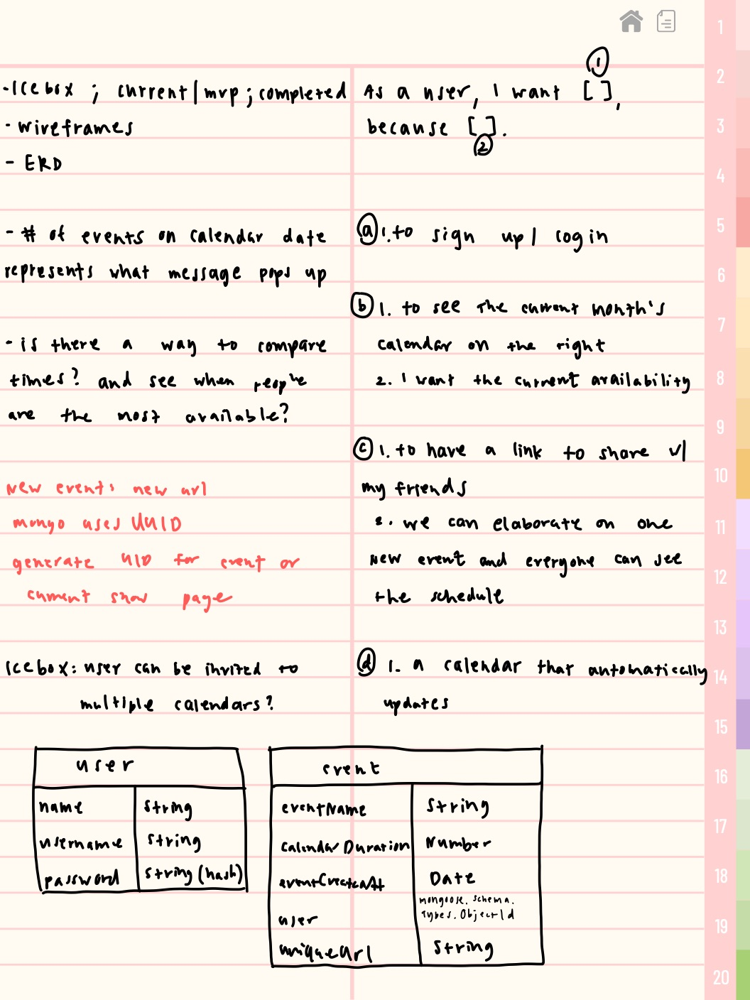

# Project Two - Scheduling Web App - Free
## Web app designed to help users plan and manage their events/schedules! 

## Deployed Site
https://free-lrig.onrender.com

### Wireframe

Possible Names:
- Let'sMeet
- FreeTime
- Free
- WhenFree
- FreeWhen
- MeetUp
- Time2Meet

### Problems I Ran Into (major/minor):
- eventID and _.id and uniqueUrl
- getting everything to link together
- making my body show in my layout
- href for my event after it posted
- anything related to the uniqueUrl
- implementing fullcalendar
- fullcalendar.io has a specific way to add, delete, and edit events on the calendar (realized I couldn't use CRUD for this model, so i applied it to my main events)
- delete route not working, router.delete and a tag does not work together because a tag tries to GET instead of DELETE (even with my data-method)
- css wasn't linking (had /public/ in front)

### Notes
- css is coming from bootstrap and fullcalendar 

### Languages/Tools Used
- EJS, Javascript, CSS, HTML, MongoDB,
- FullCalendar.io

### Icebox
- still have to implement calendar scheduling while in specific event, FullCalendar already has it implemented in its plugin
- some of my routing is still a little funky, so need to clean that up
- a lot of CSS 

