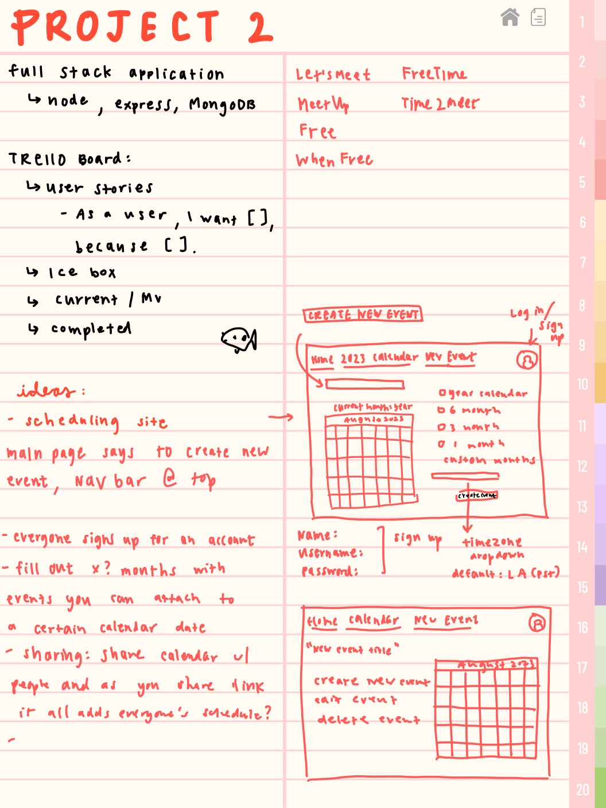

# Project Two - Scheduling App
Possible Names:
- Let'sMeet
- FreeTime
- Free
- WhenFree
- FreeWhen
- MeetUp
- Time2Meet

### Wireframe

### Problems I Ran Into (major/minor):
- eventID and _.id and uniqueUrl
- getting everything to link together
- making my body show in my layout
- href for my event after it posted
- anything related to the uniqueUrl
- fullcalendar.io has a specific way to add, delete, and edit events on the calendar (realized I couldn't use CRUD for this model, so i applied it to my main events)
- delete route not working

### Notes
- css is coming from bootstrap and fullcalendar

### Languages/Tools Used
- EJS, Javascript, CSS, HTML
- FullCalendar.io

### Icebox
- still have to implement calendar scheduling while in specific event, FullCalendar already has it implemented in its plugin
- some of my routing is still a little funky, so need to clean that up

